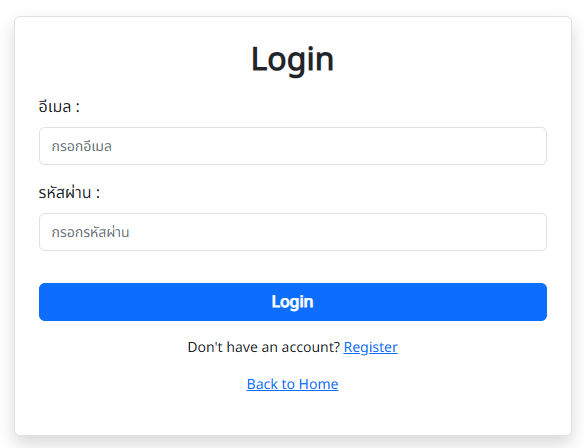
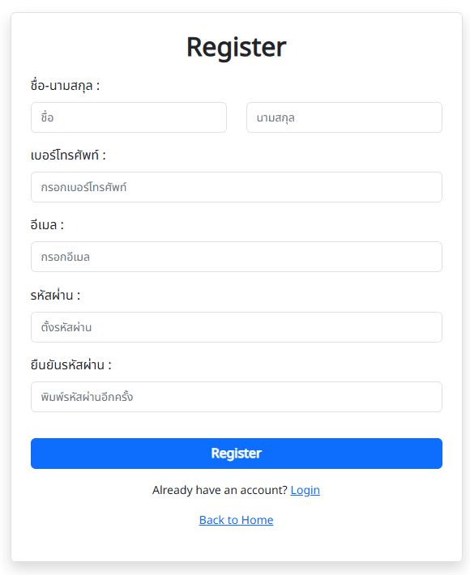

# React Firebase Auth (TypeScript)

Starter template for building authentication flows using **React + Firebase**, written in **TypeScript**.  
This project is designed to be a **boilerplate** for login/register systems with routing, validation, API calls (via Axios), and user context management — ready to extend and customize for real-world applications.

> ⚙️ Built with [Vite](https://vitejs.dev), [Firebase Auth + Firestore](https://firebase.google.com/), and [React 19](https://react.dev/)

---

## 🖼️ Preview

### 🔐 Login Page


### 📝 Register Page


---

## 🔋 Features

- ✅ React 19 + Vite (HMR, modern setup)
- 🟦 TypeScript support
- 🔐 Firebase Authentication (Email/Password)
- 📦 Firestore integration
- 💾 Custom `UserAuthContext` with context API
- 📄 Protected Routes
- 📋 Form validation using **Formik + Yup**
- ⚠️ Duplicate email check before registration
- 📢 Toast notifications with **React-Toastify**
- 🌀 Axios integration for calling external APIs
- ✨ Animated 404 Page (Page Not Found)
- 🎨 UI with Bootstrap 5 + React-Bootstrap
- 📁 Path aliases for clean import structure

---

## 📁 Folder Structure

```
src/
├── assets/          # Static images, logos, icons
├── auth/            # Auth guards
├── components/      # Shared UI components
├── config/          # Global config
├── context/         # React context providers
├── css/             # Global styles & font setup
├── helpers/         # Utility functions
├── pages/           # Page components
├── router/          # Router config with React Router
├── services/        # Axios API calls
├── types/           # Type definitions
├── App.tsx          # Main app layout
├── main.tsx         # Vite entry file
├── firebase.ts      # Firebase config/init
└── index.css        # Root CSS entry
```

---

## 🚀 Getting Started

### 1. Clone the repository

```bash
git clone https://github.com/your-username/react-firebase-auth-typescript.git
cd react-firebase-auth-typescript
```

### 2. Install dependencies

```bash
npm install
```

### 3. Create `.env` file

Create a `.env` file based on `.env.example` and set your Firebase credentials:

```
VITE_FIREBASE_API_KEY=...
VITE_FIREBASE_AUTH_DOMAIN=...
VITE_FIREBASE_PROJECT_ID=...
...
```
> 🔐 **Do not commit** your `.env` file

### 4. Run the development server

```bash
npm run dev
```

Then open [http://localhost:5173](http://localhost:5173)

---

## 🔧 Firebase Setup Guide

Before running the project, make sure you have a Firebase project ready and follow these steps:

### 1. Enable Authentication
- Go to **Firebase Console** > **Build > Authentication**
- Click **"Get started"**
- Enable **Email/Password** as a Sign-in method

### 2. Create Firestore Database
- Go to **Firebase Console** > **Build > Firestore Database**
- Click **"Create database"**
- Choose **"Start in test mode"** (for development)
- Select a region (e.g., `asia-southeast1`)

### 3. Get Firebase config
- Go to **Project Settings** > **Your apps**
- Create a new **Web app** (</> icon)
- Copy your Firebase config and paste it into a `.env` file:

```env
VITE_FIREBASE_API_KEY=...
VITE_FIREBASE_AUTH_DOMAIN=...
VITE_FIREBASE_PROJECT_ID=...
VITE_FIREBASE_STORAGE_BUCKET=...
VITE_FIREBASE_MESSAGING_SENDER_ID=...
VITE_FIREBASE_APP_ID=...
VITE_FIREBASE_MEASUREMENT_ID=...
```

> 🧪 Tip: You can use `.env.example` as a reference

---

## 📚 Inspiration & Credits

✨ This project was originally inspired by a [YouTube tutorial](https://www.youtube.com/watch?v=x74LZmGmly8) on Firebase Authentication using React.  
✨ I initially followed the tutorial as a learning exercise, then rewrote it in TypeScript for better type safety and scalability. It has since been extended with additional features such as API integration via Axios, global configuration setup, and various improvements in structure, styling, validation, and overall developer experience.

---

## 🧱 Tech Stack

| Technology           | Description / Link |
|----------------------|--------------------|
| **React**            | [react.dev](https://react.dev/) |
| **TypeScript**       | [typescriptlang.org](https://www.typescriptlang.org/) |
| **Vite**             | [vitejs.dev](https://vitejs.dev/) |
| **Firebase**         | [firebase.google.com](https://firebase.google.com/) |
| **Axios**            | [axios-http.com](https://axios-http.com/) |
| **Formik**           | [formik.org](https://formik.org/) |
| **Yup**              | [github.com/jquense/yup](https://github.com/jquense/yup) |
| **React-Bootstrap**  | [react-bootstrap.github.io](https://react-bootstrap.github.io/) |
| **React-Router-Dom** | [reactrouter.com](https://reactrouter.com/) |
| **React-Toastify**   | [react-toastify](https://fkhadra.github.io/react-toastify/) |
| **Animate.css**      | [animate.style](https://animate.style/) |

---

## 📌 License

This project is provided publicly for learning and inspiration.  
You are welcome to **clone**, **adapt**, and **extend** it for your own use.

However, please note:
- ❌ This repository is **not open for contributions** (no pull requests)
- ❌ Do not redistribute modified versions under the same repository name
- 🔒 No official open source license has been applied yet

---

Made with ❤️ by [Suphatchari]